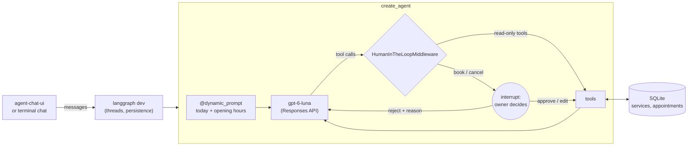

# Salon Booking Agent

A chat assistant that takes appointments for a small hair salon, with one rule it cannot
get around: **nothing is written to the calendar until the salon owner approves it.**
Customers ask about services, free times and their own bookings in plain language. When
the assistant wants to book or cancel, the conversation pauses and the owner gets an
approval card: approve it, reject it with a reason the customer will hear, or change the
time before it is saved.

Built with LangChain's `create_agent` and `HumanInTheLoopMiddleware`, a SQLite calendar,
[agent-chat-ui](https://github.com/langchain-ai/agent-chat-ui) as the chat front end, and
LangSmith tracing.


## What it does

- Answers questions about services, prices, durations and opening hours.
- Finds free start times for a service on a given day, and a customer's upcoming bookings.
- Books and cancels appointments, but every booking and cancellation first stops at the
  owner, who can **approve**, **reject** with a reason, or **edit** the booking (a
  cancellation can be approved or rejected).
- Keeps the conversation in memory per chat thread, so "book it for 12 then" works.
- Refuses anything the calendar does not allow (a taken slot, a closed day, a time in
  the past) even when the owner has approved it.

## How it works



| Tool | What it does | Owner review |
|---|---|---|
| `list_services()` | services, durations and prices | — |
| `check_availability(date, service)` | free start times on a day | — |
| `find_appointments(customer_name)` | a customer's upcoming bookings | — |
| `book_appointment(customer_name, service, start_time)` | creates a booking | approve / edit / reject |
| `cancel_appointment(appointment_id)` | cancels a booking | approve / reject |

| Building block | Where it lives |
|---|---|
| `create_agent` with a model instance, tools and middleware | [`agent.py`](src/salon_booking_agent/agent.py) `build_agent()` |
| Tools with `@tool`; the docstrings are the contract the model reads | [`tools.py`](src/salon_booking_agent/tools.py) |
| Runtime context (`context_schema`, `ToolRuntime`) | `SalonContext`: the salon's name and a pinnable "today" |
| Dynamic system prompt (`@dynamic_prompt`) | today's date and the next seven days are injected on every call |
| Short-term memory: checkpointer + `thread_id` | `InMemorySaver` in the scripts; the server's own persistence under `langgraph dev` |
| Human approval: `HumanInTheLoopMiddleware` | `interrupt_on` for `book_appointment` and `cancel_appointment` |
| Resuming with `Command(resume={"decisions": [...]})` | [`demo.py`](src/salon_booking_agent/demo.py), [`scripts/acceptance.py`](scripts/acceptance.py) |
| Chat UI with approval cards | agent-chat-ui against `langgraph dev` |
| Tracing | every run goes to the LangSmith project `salon-booking-agent` |

### Design decisions

- **The calendar rules live in code, not in the prompt.** [`db.py`](src/salon_booking_agent/db.py)
  checks opening hours, the 30-minute grid and the past, then looks for an overlapping
  appointment and inserts inside one `BEGIN IMMEDIATE` transaction. If the owner approves
  a taken slot, or edits a request onto one, the tool still refuses it. Name lookups fold
  Turkish letters, so *AYŞE YILMAZ* and *Ayse Yilmaz* find the same bookings; past
  bookings are neither listed nor cancellable.
- **Refusals are returned, not raised.** An exception inside a LangChain tool aborts the
  whole agent run. A returned `NOT BOOKED: …` string reaches the model instead, and the
  model explains it to the customer.
- **Explicit `allowed_decisions`, never `True`.** `interrupt_on={"tool": True}` also
  enables a `respond` decision, which agent-chat-ui cannot render.
- **Approval cards do no I/O.** Their descriptions are built inside the middleware on the
  server's event loop, where `langgraph dev` rejects blocking calls (`BlockingError`), so
  they read the static service catalogue and the conversation instead of SQLite.
- **An edited booking keeps the model's original call in the history** (LangChain 1.4
  behaviour), and the tool result starts with a notice. The prompt tells the model to
  trust the tool result, so the customer hears the owner's time, not the one first
  proposed.
- **gpt-6 models need the Responses API for tool calling** (Chat Completions only allows
  tools at reasoning effort `none`), so the model is built with
  `ChatOpenAI(..., use_responses_api=True, reasoning={"effort": "low"})`.

## Run it

You need Python 3.12 with [uv](https://docs.astral.sh/uv/), an OpenAI API key, and for the
chat UI Node 22+ with pnpm. A LangSmith key is optional; with one, every run is traced.

```bash
git clone https://github.com/brkakyldz/salon-booking-agent.git
cd salon-booking-agent
cp env.example .env             # then fill in OPENAI_API_KEY (and LANGSMITH_API_KEY)
uv sync
uv run salon-seed               # services + a few bookings on the next three open days
uv run salon-chat --scripted    # three conversations: approved, rejected, time edited
uv run salon-chat               # interactive: you are the customer and the owner
```

### With agent-chat-ui

```bash
# terminal 1: the agent server
uv run langgraph dev --no-browser

# terminal 2: the chat UI, cloned anywhere outside this repository
git clone https://github.com/langchain-ai/agent-chat-ui.git
cd agent-chat-ui
pnpm install
NEXT_PUBLIC_API_URL=http://localhost:2024 NEXT_PUBLIC_ASSISTANT_ID=agent pnpm dev
# PowerShell: $env:NEXT_PUBLIC_API_URL="http://localhost:2024"; $env:NEXT_PUBLIC_ASSISTANT_ID="agent"; pnpm dev
```

Open http://localhost:3000. Resolve each approval card with its buttons before you type
the next message: if you type while an approval is pending, agent-chat-ui fills the
unanswered tool call with a placeholder result.

`langgraph dev` reads `.env` once at start-up, so restart it after changing a key. On
Windows, set `PYTHONUTF8=1` if you redirect `langgraph` output to a file or a pipe; its
help text contains emoji that a legacy console code page cannot encode.

## Tests and checks

```bash
uv run pytest                          # 33 tests, no network: calendar rules + the approval flow with a scripted model
uv run python scripts/acceptance.py    # end-to-end checks against the real model and LangSmith
```

`scripts/acceptance.py` reseeds its own database relative to today and runs each check
against `gpt-6-luna`. Run of 2026-10-01: **7/7 passed** (full output in
[`docs/acceptance-2026-10-01.txt`](docs/acceptance-2026-10-01.txt)).

| # | Check | Result | Evidence |
|---|---|---|---|
| 1 | Free times match the calendar | PASS | expected `09:00, 12:00, 12:30, 13:00, 16:00, 16:30, 17:00, 17:30, 18:00`; the answer lists exactly these |
| 2a | A booking pauses; **approve** writes it | PASS | one interrupt; row `#7 2026-10-02T12:00` |
| 2b | **Reject** writes nothing and the customer hears why | PASS | 7 → 7 appointments; *"your beard trim wasn't booked—the barber is off that afternoon. Would you like me to check another time?"* |
| 2c | **Edit** books the owner's time | PASS | asked for 11:00, owner set 13:00; row `#8 2026-10-02T13:00`; *"The salon owner changed the requested time from 11:00 to 13:00."* |
| 3 | A clash is refused inside the tool, even after approval | PASS | owner edits a request onto 10:30; tool returns `NOT BOOKED: … overlaps an existing appointment (10:00–11:00)` |
| 4 | The same thread remembers; a new one does not | PASS | same thread recalls *"Deniz Aydın … 12:00 to 13:00"*; a new thread asks for the name |
| 5 | Traces before and after the pause land in LangSmith, in one thread | PASS | 3 root runs in the thread: run 1 stops at `HumanInTheLoopMiddleware.after_model` with no tool run, run 2 (after approval) contains `book_appointment` |

The demo at the top is a real run of the same flow through `langgraph dev` and
agent-chat-ui; only the seconds spent waiting for the model are cut.

## Tracing

Every run goes to the LangSmith project `salon-booking-agent`. An approval splits one
conversation turn into two runs on the same thread: the run that proposes the booking
ends at `HumanInTheLoopMiddleware.after_model` without running a tool, and the run
started by the owner's decision executes it. This is that second run from the demo at
the top. Its input is the owner's `edit` decision with the changed `start_time` (12:30);
its tree shows `book_appointment` running before the model writes the confirmation.


## Project layout

```
salon-booking-agent/
├── langgraph.json             # graph "agent" for langgraph dev; reads .env
├── src/salon_booking_agent/
│   ├── config.py              # .env, LangSmith project, model factory
│   ├── db.py                  # SQLite schema, availability, booking rules
│   ├── seed.py                # salon-seed: reset the calendar relative to today
│   ├── tools.py               # the five tools + SalonContext
│   ├── agent.py               # prompt, approval-card descriptions, build_agent()
│   ├── graph.py               # module-level agent for the dev server (no checkpointer)
│   └── demo.py                # salon-chat: terminal chat with owner approval
├── scripts/acceptance.py      # end-to-end checks against the real model
└── tests/                     # pytest, offline
```

## Scope

This is a single-salon demo: the calendar is a local SQLite file and the customer data in
the seed is fictional. It does not send SMS or WhatsApp notifications, sync with a real
calendar, or handle authentication, and it is not deployed anywhere.

## License

[MIT](LICENSE)
