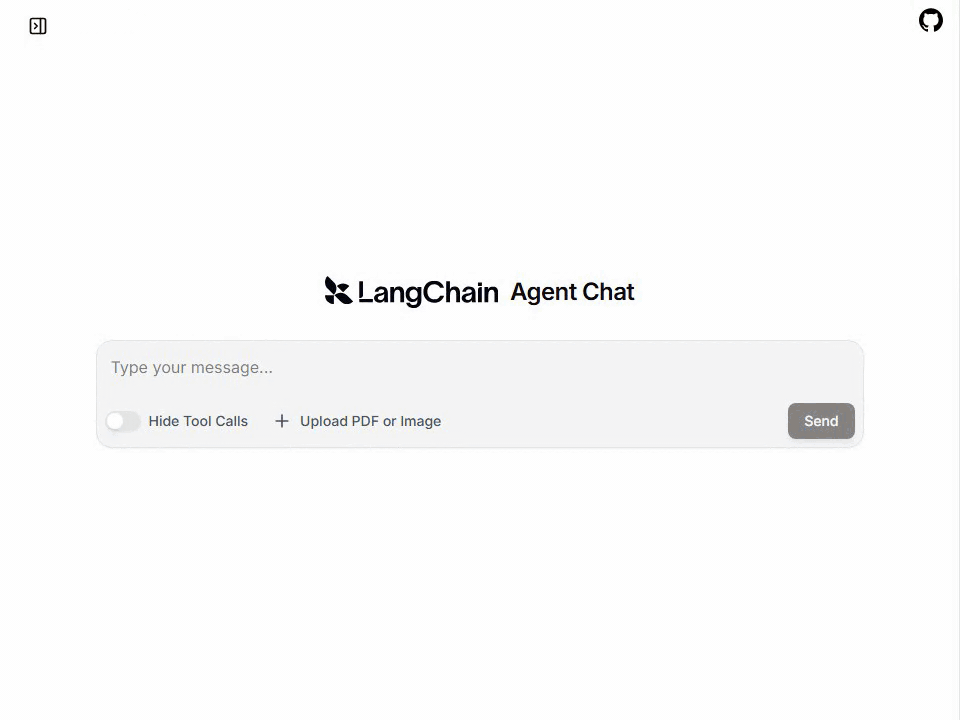
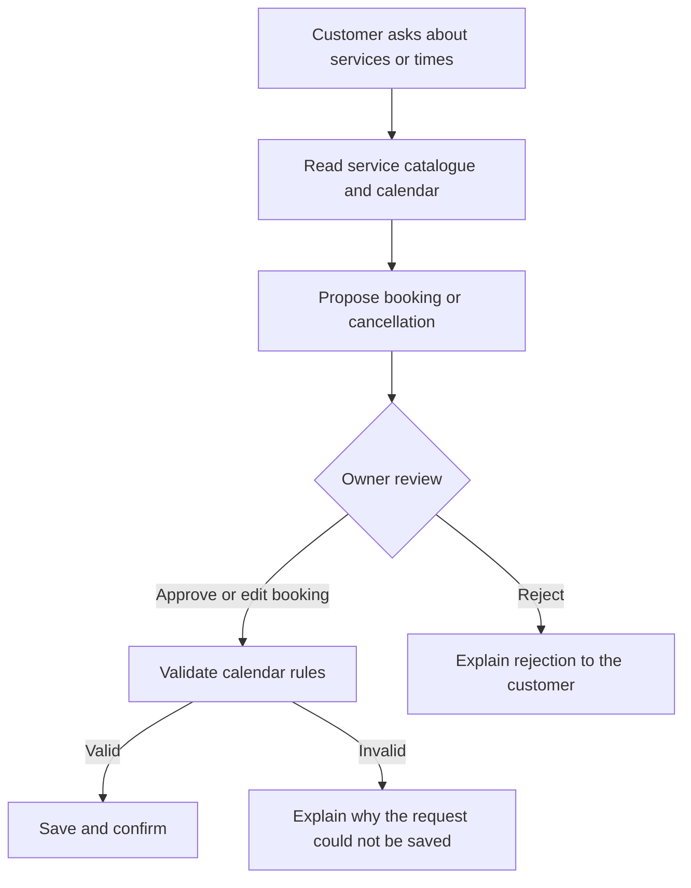
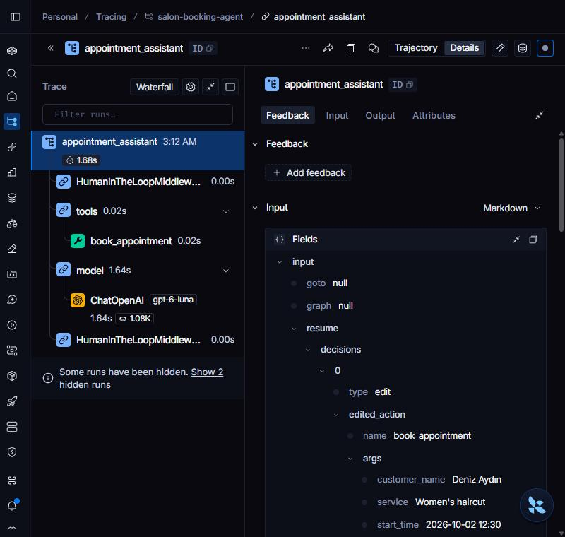

# Salon Booking Agent

A chat assistant for a small hair salon that answers service questions, finds available
times and manages appointments. Customers can ask in English or Turkish.
**Every booking and cancellation waits for the salon owner's approval before changing
the calendar.**



## What it does

- Looks up services, prices, durations and opening hours.
- Finds available start times for the requested service and day.
- Looks up a customer's upcoming appointments by name.
- Proposes a booking once it has the customer's name, service, date and time.
- Asks the owner to approve, edit or reject a booking, or approve or reject a
  cancellation.
- Remembers earlier messages within a conversation, so a customer can choose from
  the times already offered.

For example, a customer asks for a haircut at 12:00. The owner sees the customer,
service and proposed time on an approval card and changes the time to 12:30.
The assistant confirms the appointment actually saved at 12:30. If the owner rejects
the request, no booking is created and the assistant explains the reason.

## How a booking works



Built with **LangChain**, human-in-the-loop middleware, a **SQLite** calendar and
**agent-chat-ui**. Read-only lookups run immediately; calendar changes pause for review.

The calendar validates the request after approval, including an owner's edits.
Bookings must fit within opening hours, start on a 30-minute grid, be in the future
and avoid overlapping appointments. The overlap check and insert happen in one
database transaction. Approval cannot bypass those rules.

The demo salon is open Monday–Friday 09:00–19:00 and Saturday 10:00–17:00, and closed
on Sunday. Its sample catalogue includes haircuts, blow-dries, beard trims, colouring
and highlights.

## Run locally

Requirements: Python 3.12+, [uv](https://docs.astral.sh/uv/) and an OpenAI API key.
The browser chat also needs Node.js 22+ and pnpm.

```bash
git clone https://github.com/brkakyldz/salon-booking-agent.git
cd salon-booking-agent
uv sync
cp env.example .env
```

Set `OPENAI_API_KEY` in `.env`. The default model is `gpt-6-luna`; change it with
`OPENAI_MODEL`. Add `LANGSMITH_API_KEY` to enable tracing.

### Terminal chat

```bash
uv run salon-chat --scripted   # demonstrate approval, rejection and an edited time
uv run salon-chat             # interactive: play the customer and the owner
```

**Both commands reset the demo calendar by default**, populating services and
fictional bookings on the next three open days. To keep the existing calendar between
sessions, use `uv run salon-chat --no-reseed`. Appointments are stored in
`data/salon.db`; terminal conversation memory lasts for the running process.

### Browser chat with approval cards

From the project directory:

```bash
uv run salon-seed                     # initialise/reset the demo calendar
uv run langgraph dev --no-browser
```

In another terminal, clone the chat UI outside this repository:

```bash
git clone https://github.com/langchain-ai/agent-chat-ui.git
cd agent-chat-ui
pnpm install
NEXT_PUBLIC_API_URL=http://localhost:2024 NEXT_PUBLIC_ASSISTANT_ID=agent pnpm dev
```

For PowerShell, use this final command instead:

```powershell
$env:NEXT_PUBLIC_API_URL="http://localhost:2024"
$env:NEXT_PUBLIC_ASSISTANT_ID="agent"
pnpm dev
```

Open [localhost:3000](http://localhost:3000). Ask about free times, request a booking
and resolve its approval card before sending the next message. While an approval is
pending, typing a new message can cause the UI to replace the unanswered tool call
with a placeholder result.

The dev server stores conversation threads. Restart it after changing `.env`.

## Verification

```bash
uv run pytest
uv run python scripts/acceptance.py
```

Offline tests cover calendar rules and the approval flow with a scripted model.
The acceptance script uses the real model and LangSmith with its own seeded database.

The recorded acceptance run on **2026-10-01** passed **7/7 checks**, covering available
times, approved/rejected/edited bookings, refusal of a conflicting slot, conversation
memory and traces across the approval pause.
[Full results](docs/acceptance-2026-10-01.txt).

<details>
<summary>LangSmith trace</summary>

With tracing enabled, runs appear in `salon-booking-agent`. The trace links the request
that paused for review with the resumed run that saves the approved appointment.



</details>

## Current scope

A local, single-salon demo with fictional customer data and one shared calendar.
It has no separate staff calendars, authentication or customer/owner accounts.
The same demo interface handles both roles. It does not send SMS or WhatsApp messages,
sync with an external calendar or run as a deployed service.

## License

[MIT](LICENSE)
